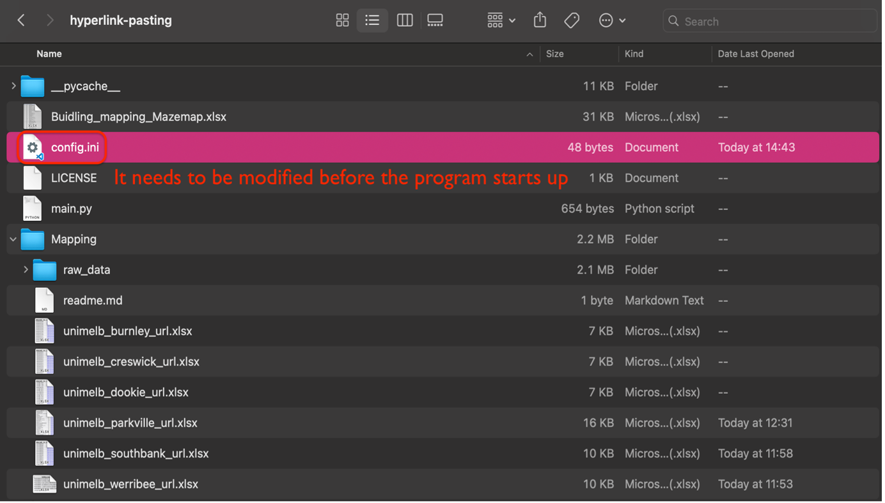
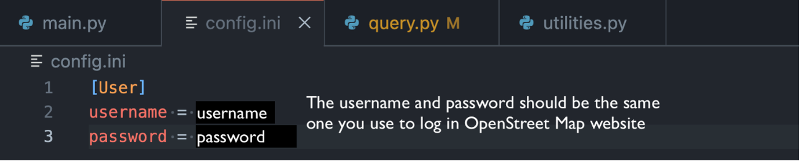
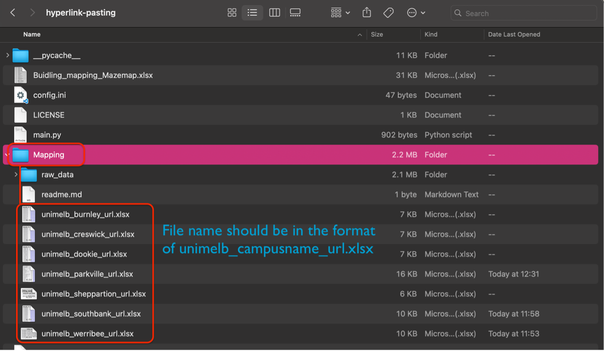
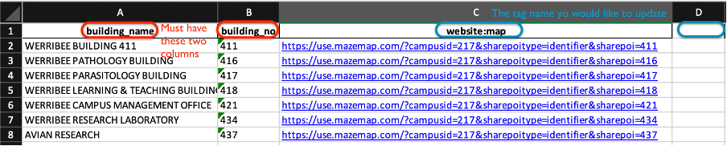
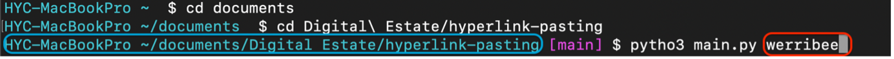
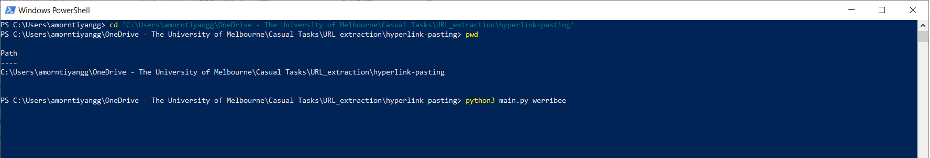
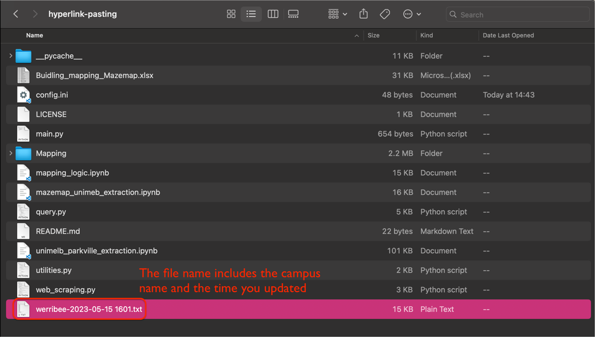
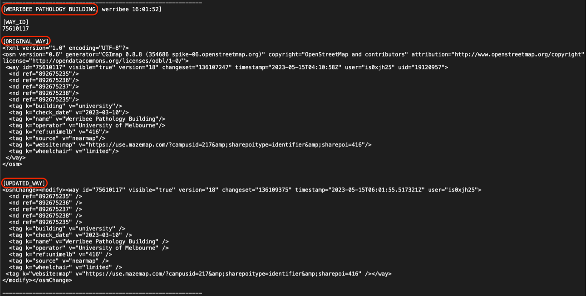

# Hyperlink Pasting

## Table of Contents
* [About the Application](#about-the-application)
* [Prerequisite OpenStreet Configuration](#prerequisite-openstreet-configuration)
* [Manage and Edit Excel](#manage-and-edit-excel)
* [Execute the Program](#execute-the-program)
* [Log File](#log-file)
* [Developed By](#developed-by)

## About the Application
Our team is encouraging the students and vistors to use Maze Map since it provides more details about buildings and classrooms, and most importantly, it has the wayfinding naviagation inside the school. Attaching Maza Map hyperlink on different map platforms could let the users know there is an altenative map while they are visting the campus. This product is going to update the building information based on the excel data to OpenStreet Map automatically. It should also have error handling for unexpected error. This program would be the first version, the functionaility of editing information on Goolge Map can be added in the future.

## Prerequisite OpenStreet Configuration
Before executing a program, the config.ini must be edited to include your username and password OpenStreet Map account in order to grant the change node request process.
1.	Find or create the config.ini file to include your username and password for the upcoming updating process.

  

2.	Type in the username and password which used to login to OpenStreet.

  

For login/register: https://www.openstreetmap.org/login?referer=%2F

## Manage and Edit Excel
- **Manage** 
 Program and data are saved in hyperlink-pasting folder. Anything in the folder is not suggested to be moved and edited, except the excel files and the    configure file (config.ini).
 

  

- **Edit** 
In the excel file, the _building_name_ and _building_no_ are mandatory. The rest of the column names are for the tags you would like to update.

  

More information about OpenStreet tags: https://wiki.openstreetmap.org/wiki/Tags

## Execute the Program
To start up the program after the excel data is updated, we will type the command `python3 main.py campus_name` (such as parkville, werribee, southbank, etc ) in shell. Depending on the computer system, you would have different command lines to initiate the program.

  

  

## Log File
A log file would be generated every time the program has been executed. In the file, it displays the building name, the original information about the building and the updated information, and most importantly, whether the update is successful or not.

  

  

If there is no error appears in the section, it means the building information has been updated. However, if there is an error, you may want to check the building name on OpenStreet Map and in the excel since the error occurs when the names are not consistent in most of time.

## Developed By
[Yun-Chi Hsiao](https://is0xjh25.github.io) 
_Digital Wayfinding **Software Engineer Intern**, Digital Estate. 
Campus Management, Business Services, The University of Melbourne _
 
[Boat Amorntiyanggoon](https://github.com/supAmorn) 
_Digital Wayfinding **Coordinator**, Digital Estate. 
Campus Management, Business Services, The University of Melbourne_
